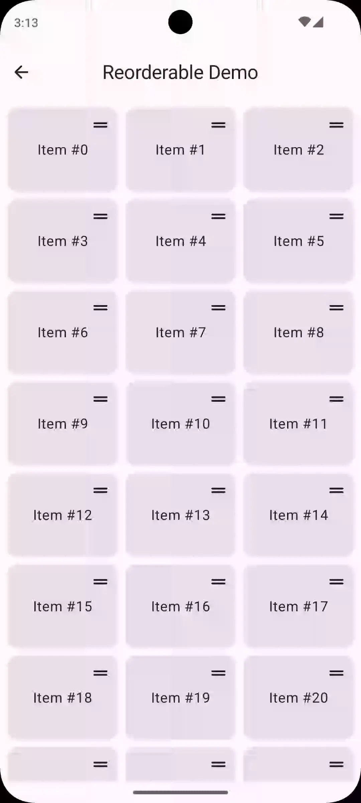

# Reorderable

Reorderable is a simple library that allows you to reorder items in [`LazyColumn`](<https://developer.android.com/reference/kotlin/androidx/compose/foundation/lazy/package-summary#LazyColumn(androidx.compose.ui.Modifier,androidx.compose.foundation.lazy.LazyListState,androidx.compose.foundation.layout.PaddingValues,kotlin.Boolean,androidx.compose.foundation.layout.Arrangement.Vertical,androidx.compose.ui.Alignment.Horizontal,androidx.compose.foundation.gestures.FlingBehavior,kotlin.Boolean,kotlin.Function1)>), [`LazyRow`](<https://developer.android.com/reference/kotlin/androidx/compose/foundation/lazy/package-summary#LazyRow(androidx.compose.ui.Modifier,androidx.compose.foundation.lazy.LazyListState,androidx.compose.foundation.layout.PaddingValues,kotlin.Boolean,androidx.compose.foundation.layout.Arrangement.Horizontal,androidx.compose.ui.Alignment.Vertical,androidx.compose.foundation.gestures.FlingBehavior,kotlin.Boolean,kotlin.Function1)>), [`LazyVerticalGrid`](<https://developer.android.com/reference/kotlin/androidx/compose/foundation/lazy/grid/package-summary#LazyVerticalGrid(androidx.compose.foundation.lazy.grid.GridCells,androidx.compose.ui.Modifier,androidx.compose.foundation.lazy.grid.LazyGridState,androidx.compose.foundation.layout.PaddingValues,kotlin.Boolean,androidx.compose.foundation.layout.Arrangement.Vertical,androidx.compose.foundation.layout.Arrangement.Horizontal,androidx.compose.foundation.gestures.FlingBehavior,kotlin.Boolean,kotlin.Function1)>), [`LazyHorizontalGrid`](<https://developer.android.com/reference/kotlin/androidx/compose/foundation/lazy/grid/package-summary#LazyHorizontalGrid(androidx.compose.foundation.lazy.grid.GridCells,androidx.compose.ui.Modifier,androidx.compose.foundation.lazy.grid.LazyGridState,androidx.compose.foundation.layout.PaddingValues,kotlin.Boolean,androidx.compose.foundation.layout.Arrangement.Horizontal,androidx.compose.foundation.layout.Arrangement.Vertical,androidx.compose.foundation.gestures.FlingBehavior,kotlin.Boolean,kotlin.Function1)>), [`LazyVerticalStaggeredGrid`](<https://developer.android.com/reference/kotlin/androidx/compose/foundation/lazy/staggeredgrid/package-summary#LazyVerticalStaggeredGrid(androidx.compose.foundation.lazy.staggeredgrid.StaggeredGridCells,androidx.compose.ui.Modifier,androidx.compose.foundation.lazy.staggeredgrid.LazyStaggeredGridState,androidx.compose.foundation.layout.PaddingValues,kotlin.Boolean,androidx.compose.ui.unit.Dp,androidx.compose.foundation.layout.Arrangement.Horizontal,androidx.compose.foundation.gestures.FlingBehavior,kotlin.Boolean,kotlin.Function1)>), and [`LazyHorizontalStaggeredGrid`](<https://developer.android.com/reference/kotlin/androidx/compose/foundation/lazy/staggeredgrid/package-summary#LazyHorizontalStaggeredGrid(androidx.compose.foundation.lazy.staggeredgrid.StaggeredGridCells,androidx.compose.ui.Modifier,androidx.compose.foundation.lazy.staggeredgrid.LazyStaggeredGridState,androidx.compose.foundation.layout.PaddingValues,kotlin.Boolean,androidx.compose.foundation.layout.Arrangement.Vertical,androidx.compose.ui.unit.Dp,androidx.compose.foundation.gestures.FlingBehavior,kotlin.Boolean,kotlin.Function1)>) as well as [`Column`](<https://developer.android.com/reference/kotlin/androidx/compose/foundation/layout/package-summary#Column(androidx.compose.ui.Modifier,androidx.compose.foundation.layout.Arrangement.Vertical,androidx.compose.ui.Alignment.Horizontal,kotlin.Function1)>) and [`Row`](<https://developer.android.com/reference/kotlin/androidx/compose/foundation/layout/package-summary#Row(androidx.compose.ui.Modifier,androidx.compose.foundation.layout.Arrangement.Horizontal,androidx.compose.ui.Alignment.Vertical,kotlin.Function1)>) in Jetpack Compose and Compose Multiplatform with drag and drop.

The latest demo app APK can be found in the [releases](https://github.com/Calvin-LL/Reorderable/releases) section under the "Assets" section of the latest release.

<table width="100%" align="center">
  <thead>
    <tr>
      <th width="50%">LazyColumn</th>
      <th width="50%">LazyGrid</th>
    </tr>
  </thead>
  <tbody>
    <tr>
      <td width="50%">
        
      </td>
      <td width="50%">
        
      </td>
    </tr>
  </tbody>
</table>

## Used By

- [Lawnchair](https://github.com/LawnchairLauncher/lawnchair/blob/10889eb9772d5ec05f8ec536db3986ad5d9f4f33/build.gradle#L420) 
- [Home Assistant](https://github.com/home-assistant/android/blob/b7281155f1bdc0bf53780e8b304cda1ae0532fd4/gradle/libs.versions.toml#L211) 
- [ProtonVPN](https://github.com/ProtonVPN/android-app/blob/c1543ff1c299df376dac762d12e6049de95fdea8/app/build.gradle#L796) 
- [Pocket Casts](https://github.com/Automattic/pocket-casts-android/blob/96cb6c6c3e210800a5fd2365776eee896079e255/gradle/libs.versions.toml#L281) 
- [gkd](https://github.com/gkd-kit/gkd/blob/de140488aa42330d282cc41b92127237308e25f2/gradle/libs.versions.toml#L63) 
- [Mihon](https://github.com/mihonapp/mihon/blob/919607cd06ee45ac667a2fd650d85aaf6ebb9762/gradle/libs.versions.toml#L68) 
- [AB Download Manager](https://github.com/amir1376/ab-download-manager/blob/dcf802b0583ab44fc806c86fc715fd2364d811db/gradle/libs.versions.toml#L100) 
- [ImageToolbox](https://github.com/T8RIN/ImageToolbox/blob/f03ba7e7dd497b215cc14cf80ee4991d42d101a4/gradle/libs.versions.toml#L160) 
- [Aniyomi](https://github.com/aniyomiorg/aniyomi/blob/0697aad3204cf95547edcde1b98ca80c124d2677/gradle/libs.versions.toml#L67) 
- [InnerTune](https://github.com/z-huang/InnerTune/blob/ba3a3a0fe9d3499205a7fc91649938091cad75b8/gradle/libs.versions.toml#L34) 
- [StreetComplete](https://github.com/streetcomplete/StreetComplete/blob/bcb8b58597c5e55b59b71be3568eed5e6a025e9b/app/build.gradle.kts#L154) 
- [HeliBoard](https://github.com/Helium314/HeliBoard/blob/0787a79de4d118aa5efc7515cc3d5c84aa834951/app/build.gradle.kts#L122) 
- [EhViewer](https://github.com/FooIbar/EhViewer/blob/4bb6b0baf69f4e996e1dd0bdb89a7f112819bf02/gradle/libs.versions.toml#L102) 
- [bilimiao](https://github.com/10miaomiao/bilimiao2/blob/b806379206283309defd6d0ef9ad3b575dd46642/bilimiao-compose/build.gradle.kts#L83) 
- [Twine](https://github.com/msasikanth/twine/blob/841defa05f03c13e56fd331e288f9a5e676862ca/gradle/libs.versions.toml#L124) 
- [Neo Launcher](https://github.com/NeoApplications/Neo-Launcher/blob/c3788690e31d13249ae70e9db628ed7e9baa86d4/gradle/libs.versions.toml#L112) 
- [Komikku](https://github.com/komikku-app/komikku/blob/2661122d9ae532442526de136b25adb8045803ed/gradle/libs.versions.toml#L66) 
- [Stream Chat](https://github.com/GetStream/stream-chat-android/blob/95a3f812991d7fe1e91d7457d125a039aeff704c/buildSrc/src/main/kotlin/io/getstream/chat/android/Dependencies.kt#L217) 
- [EinkBro](https://github.com/plateaukao/einkbro/blob/4dfa50fff1ced5035d1be77ef5af55ac165375e6/app/build.gradle.kts#L148) 

## Features

- Supports Compose Multiplatform (Android, iOS, Desktop/JVM, Wasm, JS)
- Supports items of different sizes
- Some items can be made non-reorderable
- Supports dragging and animating the first visible item
- Supports dragging immediately or long press to start dragging
- Supports section headers and footers
- Scrolls when dragging to the edge of the screen. (unavailable for [`Column`](<https://developer.android.com/reference/kotlin/androidx/compose/foundation/layout/package-summary#Column(androidx.compose.ui.Modifier,androidx.compose.foundation.layout.Arrangement.Vertical,androidx.compose.ui.Alignment.Horizontal,kotlin.Function1)>) and [`Row`](<https://developer.android.com/reference/kotlin/androidx/compose/foundation/layout/package-summary#Row(androidx.compose.ui.Modifier,androidx.compose.foundation.layout.Arrangement.Horizontal,androidx.compose.ui.Alignment.Vertical,kotlin.Function1)>)) The scroll speed is based on the distance from the edge of the screen.
- Uses the new [`Modifier.animateItem`](<https://developer.android.com/reference/kotlin/androidx/compose/foundation/lazy/LazyItemScope#(androidx.compose.ui.Modifier).animateItem(androidx.compose.animation.core.FiniteAnimationSpec,androidx.compose.animation.core.FiniteAnimationSpec,androidx.compose.animation.core.FiniteAnimationSpec)>) API to animate item movement in [`LazyColumn`](<https://developer.android.com/reference/kotlin/androidx/compose/foundation/lazy/package-summary#LazyColumn(androidx.compose.ui.Modifier,androidx.compose.foundation.lazy.LazyListState,androidx.compose.foundation.layout.PaddingValues,kotlin.Boolean,androidx.compose.foundation.layout.Arrangement.Vertical,androidx.compose.ui.Alignment.Horizontal,androidx.compose.foundation.gestures.FlingBehavior,kotlin.Boolean,kotlin.Function1)>), [`LazyRow`](<https://developer.android.com/reference/kotlin/androidx/compose/foundation/lazy/package-summary#LazyRow(androidx.compose.ui.Modifier,androidx.compose.foundation.lazy.LazyListState,androidx.compose.foundation.layout.PaddingValues,kotlin.Boolean,androidx.compose.foundation.layout.Arrangement.Horizontal,androidx.compose.ui.Alignment.Vertical,androidx.compose.foundation.gestures.FlingBehavior,kotlin.Boolean,kotlin.Function1)>), [`LazyVerticalGrid`](<https://developer.android.com/reference/kotlin/androidx/compose/foundation/lazy/grid/package-summary#LazyVerticalGrid(androidx.compose.foundation.lazy.grid.GridCells,androidx.compose.ui.Modifier,androidx.compose.foundation.lazy.grid.LazyGridState,androidx.compose.foundation.layout.PaddingValues,kotlin.Boolean,androidx.compose.foundation.layout.Arrangement.Vertical,androidx.compose.foundation.layout.Arrangement.Horizontal,androidx.compose.foundation.gestures.FlingBehavior,kotlin.Boolean,kotlin.Function1)>), [`LazyHorizontalGrid`](<https://developer.android.com/reference/kotlin/androidx/compose/foundation/lazy/grid/package-summary#LazyHorizontalGrid(androidx.compose.foundation.lazy.grid.GridCells,androidx.compose.ui.Modifier,androidx.compose.foundation.lazy.grid.LazyGridState,androidx.compose.foundation.layout.PaddingValues,kotlin.Boolean,androidx.compose.foundation.layout.Arrangement.Horizontal,androidx.compose.foundation.layout.Arrangement.Vertical,androidx.compose.foundation.gestures.FlingBehavior,kotlin.Boolean,kotlin.Function1)>), [`LazyVerticalStaggeredGrid`](<https://developer.android.com/reference/kotlin/androidx/compose/foundation/lazy/staggeredgrid/package-summary#LazyVerticalStaggeredGrid(androidx.compose.foundation.lazy.staggeredgrid.StaggeredGridCells,androidx.compose.ui.Modifier,androidx.compose.foundation.lazy.staggeredgrid.LazyStaggeredGridState,androidx.compose.foundation.layout.PaddingValues,kotlin.Boolean,androidx.compose.ui.unit.Dp,androidx.compose.foundation.layout.Arrangement.Horizontal,androidx.compose.foundation.gestures.FlingBehavior,kotlin.Boolean,kotlin.Function1)>), and [`LazyHorizontalStaggeredGrid`](<https://developer.android.com/reference/kotlin/androidx/compose/foundation/lazy/staggeredgrid/package-summary#LazyHorizontalStaggeredGrid(androidx.compose.foundation.lazy.staggeredgrid.StaggeredGridCells,androidx.compose.ui.Modifier,androidx.compose.foundation.lazy.staggeredgrid.LazyStaggeredGridState,androidx.compose.foundation.layout.PaddingValues,kotlin.Boolean,androidx.compose.foundation.layout.Arrangement.Vertical,androidx.compose.ui.unit.Dp,androidx.compose.foundation.gestures.FlingBehavior,kotlin.Boolean,kotlin.Function1)>)
- Supports using a child of an item as the drag handle

## Usage

### Version Catalog

If you're using Version Catalog, add the following to your `libs.versions.toml` file:

```toml
[versions]
#...
reorderable = "3.0.0"

[libraries]
#...
reorderable = { module = "sh.calvin.reorderable:reorderable", version.ref = "reorderable" }
```

or

```toml
[libraries]
#...
reorderable = { module = "sh.calvin.reorderable:reorderable", version = "3.0.0" }
```

then

```kotlin
dependencies {
    // ...
    implementation(libs.reorderable)
}
```

### Gradle

If you're using Gradle instead, add the following to your `build.gradle` file:

#### Kotlin DSL

```kotlin
dependencies {
    // ...
    implementation("sh.calvin.reorderable:reorderable:3.0.0")
}
```

#### Groovy DSL

```groovy
dependencies {
    // ...
    implementation 'sh.calvin.reorderable:reorderable:3.0.0'
}
```

### Examples

See [demo app code](demoApp/composeApp/src/commonMain/kotlin/sh/calvin/reorderable/demo) for more examples.

#### Table of Contents

- [`LazyColumn`](#lazycolumn)
- [`LazyRow`](#lazyrow)
- [`LazyVerticalGrid`](#lazyverticalgrid)
- [`LazyHorizontalGrid`](#lazyhorizontalgrid)
- [`LazyVerticalStaggeredGrid`](#lazyverticalstaggeredgrid)
- [`LazyHorizontalStaggeredGrid`](#lazyhorizontalstaggeredgrid)
- [`Column`](#column)
- [`Row`](#row)
- [Accessibility](#accessibility)
- [FAQ](#faq)

#### `LazyColumn`

Find more examples in [`SimpleReorderableLazyColumnScreen.kt`](demoApp/composeApp/src/commonMain/kotlin/sh/calvin/reorderable/demo/ui/SimpleReorderableLazyColumnScreen.kt), [`SimpleLongPressHandleReorderableLazyColumnScreen.kt`](demoApp/composeApp/src/commonMain/kotlin/sh/calvin/reorderable/demo/ui/SimpleLongPressHandleReorderableLazyColumnScreen.kt) and [`ComplexReorderableLazyColumnScreen.kt`](demoApp/composeApp/src/commonMain/kotlin/sh/calvin/reorderable/demo/ui/ComplexReorderableLazyColumnScreen.kt) in the demo app.

##### Simple Example

To use this library with [`LazyColumn`](<https://developer.android.com/reference/kotlin/androidx/compose/foundation/lazy/package-summary#LazyColumn(androidx.compose.ui.Modifier,androidx.compose.foundation.lazy.LazyListState,androidx.compose.foundation.layout.PaddingValues,kotlin.Boolean,androidx.compose.foundation.layout.Arrangement.Vertical,androidx.compose.ui.Alignment.Horizontal,androidx.compose.foundation.gestures.FlingBehavior,kotlin.Boolean,kotlin.Function1)>), follow this basic structure:

```kotlin
val lazyListState = rememberLazyListState()
val reorderableLazyListState = rememberReorderableLazyListState(lazyListState) { from, to ->
    // Update the list
}

LazyColumn(state = lazyListState) {
    items(list, key = { /* item key */ }) {
        ReorderableItem(reorderableLazyListState, key = /* item key */) { isDragging ->
            // Item content

            IconButton(
                modifier = Modifier.draggableHandle(),
                /* ... */
            )
        }
    }
}

```

##### Complete Example (with haptic feedback)

```kotlin
val hapticFeedback = LocalHapticFeedback.current

var list by remember { mutableStateOf(List(100) { "Item $it" }) }
val lazyListState = rememberLazyListState()
val reorderableLazyListState = rememberReorderableLazyListState(lazyListState) { from, to ->
    list = list.toMutableList().apply {
        add(to.index, removeAt(from.index))
    }

    hapticFeedback.performHapticFeedback(HapticFeedbackType.SegmentFrequentTick)
}

LazyColumn(
    modifier = Modifier.fillMaxSize(),
    state = lazyListState,
    contentPadding = PaddingValues(8.dp),
    verticalArrangement = Arrangement.spacedBy(8.dp),
) {
    items(list, key = { it }) {
        ReorderableItem(reorderableLazyListState, key = it) { isDragging ->
            val elevation by animateDpAsState(if (isDragging) 4.dp else 0.dp)

            Surface(shadowElevation = elevation) {
                Row {
                    Text(it, Modifier.padding(horizontal = 8.dp))
                    IconButton(
                        modifier = Modifier.draggableHandle(
                            onDragStarted = {
                                hapticFeedback.performHapticFeedback(HapticFeedbackType.GestureThresholdActivate)
                            },
                            onDragStopped = {
                                hapticFeedback.performHapticFeedback(HapticFeedbackType.GestureEnd)
                            },
                        ),
                        onClick = {},
                    ) {
                        Icon(Icons.Rounded.DragHandle, contentDescription = "Reorder")
                    }
                }
            }
        }
    }
}
```

##### Section Headers and Footers or Multiple Lists

The `from.index` and `to.index` in `onMove` are the indices of the items in the `LazyColumn`. If you have section headers or footers, you may need to adjust the indices accordingly. For example:

```kotlin
var list by remember { mutableStateOf(List(100) { "Item $it" }) }
val lazyListState = rememberLazyListState()
val reorderableLazyColumnState = rememberReorderableLazyListState(lazyListState) { from, to ->
    list = list.toMutableList().apply {
        add(to.index - 1, removeAt(from.index - 1))
    }
}

LazyColumn(
    state = lazyListState,
    // ...
) {
    item {
        Text("Header")
    }

    items(list, key = { item -> item.id }) { item ->
        ReorderableItem(reorderableLazyColumnState, item.id) {
            // ...
        }
    }
}
```

##### Passing `Modifier.draggableHandle` to a Child Composable

Since `Modifier.draggableHandle` and `Modifier.longPressDraggableHandle` can only be used in `ReorderableCollectionItemScope`, you may need to pass `ReorderableCollectionItemScope` to a child composable. For example:

```kotlin
@Composable
fun List() {
    // ...

    LazyColumn(state = lazyListState) {
        items(list, key = { /* item key */ }) {
            ReorderableItem(reorderableLazyListState, key = /* item key */) { isDragging ->
                // Item content

                DragHandle(this)
            }
        }
    }
}

@Composable
fun DragHandle(scope: ReorderableCollectionItemScope) {
    IconButton(
        modifier = with(scope) {
            Modifier.draggableHandle()
        },
        /* ... */
    )
}
```

##### Scroll Trigger Padding

If your [`LazyColumn`](<https://developer.android.com/reference/kotlin/androidx/compose/foundation/lazy/package-summary#LazyColumn(androidx.compose.ui.Modifier,androidx.compose.foundation.lazy.LazyListState,androidx.compose.foundation.layout.PaddingValues,kotlin.Boolean,androidx.compose.foundation.layout.Arrangement.Vertical,androidx.compose.ui.Alignment.Horizontal,androidx.compose.foundation.gestures.FlingBehavior,kotlin.Boolean,kotlin.Function1)>) displays under navigation bar or notification bar, you may want to add `scrollThresholdPadding` to `rememberReorderableLazyListState` to move the scroll trigger area out from under the navigation bar or notification bar.

```kotlin
val reorderableLazyListState = rememberReorderableLazyListState(
    lazyListState = lazyListState,
    scrollThresholdPadding = WindowInsets.systemBars.asPaddingValues(),
) { from, to ->
    ...
}
```

##### Use with [`Card`](<https://developer.android.com/reference/kotlin/androidx/compose/material3/package-summary#Card(kotlin.Function0,androidx.compose.ui.Modifier,kotlin.Boolean,androidx.compose.ui.graphics.Shape,androidx.compose.material3.CardColors,androidx.compose.material3.CardElevation,androidx.compose.foundation.BorderStroke,androidx.compose.foundation.interaction.MutableInteractionSource,kotlin.Function1)>)

If you want to use the [material3's Clickable Card](<https://developer.android.com/reference/kotlin/androidx/compose/material3/package-summary#Card(kotlin.Function0,androidx.compose.ui.Modifier,kotlin.Boolean,androidx.compose.ui.graphics.Shape,androidx.compose.material3.CardColors,androidx.compose.material3.CardElevation,androidx.compose.foundation.BorderStroke,androidx.compose.foundation.interaction.MutableInteractionSource,kotlin.Function1)>), you can create a [`MutableInteractionSource`](https://developer.android.com/reference/kotlin/androidx/compose/foundation/interaction/MutableInteractionSource) and pass it to both the [`Card`](<https://developer.android.com/reference/kotlin/androidx/compose/material3/package-summary#Card(kotlin.Function0,androidx.compose.ui.Modifier,kotlin.Boolean,androidx.compose.ui.graphics.Shape,androidx.compose.material3.CardColors,androidx.compose.material3.CardElevation,androidx.compose.foundation.BorderStroke,androidx.compose.foundation.interaction.MutableInteractionSource,kotlin.Function1)>) and the `Modifier.draggableHandle` (or `Modifier.longPressDraggableHandle`), `Modifier.draggableHandle` will emit drag events to the [`MutableInteractionSource`](https://developer.android.com/reference/kotlin/androidx/compose/foundation/interaction/MutableInteractionSource) so that the [`Card`](<https://developer.android.com/reference/kotlin/androidx/compose/material3/package-summary#Card(kotlin.Function0,androidx.compose.ui.Modifier,kotlin.Boolean,androidx.compose.ui.graphics.Shape,androidx.compose.material3.CardColors,androidx.compose.material3.CardElevation,androidx.compose.foundation.BorderStroke,androidx.compose.foundation.interaction.MutableInteractionSource,kotlin.Function1)>) can respond to the drag events:

```kotlin
val hapticFeedback = LocalHapticFeedback.current

var list by remember { mutableStateOf(List(100) { "Item $it" }) }
val lazyListState = rememberLazyListState()
val reorderableLazyListState = rememberReorderableLazyListState(lazyListState) { from, to ->
    list = list.toMutableList().apply {
        add(to.index, removeAt(from.index))
    }

    hapticFeedback.performHapticFeedback(HapticFeedbackType.SegmentFrequentTick)
}

LazyColumn(
    modifier = Modifier.fillMaxSize(),
    state = lazyListState,
    contentPadding = PaddingValues(8.dp),
    verticalArrangement = Arrangement.spacedBy(8.dp),
) {
    items(list, key = { it }) { item ->
        ReorderableItem(reorderableLazyListState, key = item) {
            val interactionSource = remember { MutableInteractionSource() }

            Card(
                onClick = {},
                interactionSource = interactionSource,
            ) {
                Row {
                    Text(item, Modifier.padding(horizontal = 8.dp))
                    IconButton(
                        modifier = Modifier.draggableHandle(
                            onDragStarted = {
                                hapticFeedback.performHapticFeedback(HapticFeedbackType.GestureThresholdActivate)
                            },
                            onDragStopped = {
                                hapticFeedback.performHapticFeedback(HapticFeedbackType.GestureEnd)
                            },
                            interactionSource = interactionSource,
                        ),
                        onClick = {},
                    ) {
                        Icon(Icons.Rounded.DragHandle, contentDescription = "Reorder")
                    }
                }
            }
        }
    }
}
```

#### LazyRow

See [`SimpleReorderableLazyRowScreen.kt`](demoApp/composeApp/src/commonMain/kotlin/sh/calvin/reorderable/demo/ui/SimpleReorderableLazyRowScreen.kt) and [`ComplexReorderableLazyRowScreen.kt`](demoApp/composeApp/src/commonMain/kotlin/sh/calvin/reorderable/demo/ui/ComplexReorderableLazyRowScreen.kt) in the demo app.

##### Simple Example

To use this library with [`LazyRow`](<https://developer.android.com/reference/kotlin/androidx/compose/foundation/lazy/package-summary#LazyRow(androidx.compose.ui.Modifier,androidx.compose.foundation.lazy.LazyListState,androidx.compose.foundation.layout.PaddingValues,kotlin.Boolean,androidx.compose.foundation.layout.Arrangement.Horizontal,androidx.compose.ui.Alignment.Vertical,androidx.compose.foundation.gestures.FlingBehavior,kotlin.Boolean,kotlin.Function1)>), follow this basic structure:

```kotlin
val lazyListState = rememberLazyListState()
val reorderableLazyListState = rememberReorderableLazyListState(lazyListState) { from, to ->
    // Update the list
}

LazyRow(state = lazyListState) {
    items(list, key = { /* item key */ }) {
        ReorderableItem(reorderableLazyListState, key = /* item key */) { isDragging ->
            // Item content

            IconButton(
                modifier = Modifier.draggableHandle(),
                /* ... */
            )
        }
    }
}

```

##### Complete Example (with haptic feedback)

```kotlin
val hapticFeedback = LocalHapticFeedback.current

var list by remember { mutableStateOf(List(100) { "Item $it" }) }
val lazyListState = rememberLazyListState()
val reorderableLazyListState = rememberReorderableLazyListState(lazyListState) { from, to ->
    list = list.toMutableList().apply {
        add(to.index, removeAt(from.index))
    }

    hapticFeedback.performHapticFeedback(HapticFeedbackType.SegmentFrequentTick)
}

LazyRow(
    modifier = Modifier.fillMaxSize(),
    state = lazyListState,
    contentPadding = PaddingValues(8.dp),
    horizontalArrangement = Arrangement.spacedBy(8.dp),
) {
    items(list, key = { it }) {
        ReorderableItem(reorderableLazyListState, key = it) { isDragging ->
            val elevation by animateDpAsState(if (isDragging) 4.dp else 0.dp)

            Surface(shadowElevation = elevation) {
                Column {
                    Text(it, Modifier.padding(vertical = 8.dp))
                    IconButton(
                        modifier = Modifier.draggableHandle(
                            onDragStarted = {
                                hapticFeedback.performHapticFeedback(HapticFeedbackType.GestureThresholdActivate)
                            },
                            onDragStopped = {
                                hapticFeedback.performHapticFeedback(HapticFeedbackType.GestureEnd)
                            },
                        ),
                        onClick = {},
                    ) {
                        Icon(Icons.Rounded.DragHandle, contentDescription = "Reorder")
                    }
                }
            }
        }
    }
}
```

##### Section Headers and Footers or Multiple Lists

The `from.index` and `to.index` in `onMove` are the indices of the items in the `LazyRow`. If you have section headers or footers, you may need to adjust the indices accordingly. For example:

```kotlin
var list by remember { mutableStateOf(List(100) { "Item $it" }) }
val lazyListState = rememberLazyListState()
val reorderableLazyRowState = rememberReorderableLazyListState(lazyListState) { from, to ->
    list = list.toMutableList().apply {
        add(to.index - 1, removeAt(from.index - 1))
    }
}

LazyRow(
    state = lazyListState,
    // ...
) {
    item {
        Text("Header")
    }

    items(list, key = { item -> item.id }) { item ->
        ReorderableItem(reorderableLazyRowState, item.id) {
            // ...
        }
    }
}
```

##### Passing `Modifier.draggableHandle` to a Child Composable

Since `Modifier.draggableHandle` and `Modifier.longPressDraggableHandle` can only be used in `ReorderableCollectionItemScope`, you may need to pass `ReorderableCollectionItemScope` to a child composable. For example:

```kotlin
@Composable
fun List() {
    // ...

    LazyRow(state = lazyListState) {
        items(list, key = { /* item key */ }) {
            ReorderableItem(reorderableLazyListState, key = /* item key */) { isDragging ->
                // Item content

                DragHandle(this)
            }
        }
    }
}

@Composable
fun DragHandle(scope: ReorderableCollectionItemScope) {
    IconButton(
        modifier = with(scope) {
            Modifier.draggableHandle()
        },
        /* ... */
    )
}
```

##### Scroll Trigger Padding

If your [`LazyRow`](<https://developer.android.com/reference/kotlin/androidx/compose/foundation/lazy/package-summary#LazyRow(androidx.compose.ui.Modifier,androidx.compose.foundation.lazy.LazyListState,androidx.compose.foundation.layout.PaddingValues,kotlin.Boolean,androidx.compose.foundation.layout.Arrangement.Horizontal,androidx.compose.ui.Alignment.Vertical,androidx.compose.foundation.gestures.FlingBehavior,kotlin.Boolean,kotlin.Function1)>) displays under navigation bar or notification bar, you may want to add `scrollThresholdPadding` to `rememberReorderableLazyListState` to move the scroll trigger area out from under the navigation bar or notification bar.

```kotlin
val reorderableLazyListState = rememberReorderableLazyListState(
    lazyListState = lazyListState,
    scrollThresholdPadding = WindowInsets.systemBars.asPaddingValues(),
) { from, to ->
    ...
}
```

##### Use with [`Card`](<https://developer.android.com/reference/kotlin/androidx/compose/material3/package-summary#Card(kotlin.Function0,androidx.compose.ui.Modifier,kotlin.Boolean,androidx.compose.ui.graphics.Shape,androidx.compose.material3.CardColors,androidx.compose.material3.CardElevation,androidx.compose.foundation.BorderStroke,androidx.compose.foundation.interaction.MutableInteractionSource,kotlin.Function1)>)

If you want to use the [material3's Clickable Card](<https://developer.android.com/reference/kotlin/androidx/compose/material3/package-summary#Card(kotlin.Function0,androidx.compose.ui.Modifier,kotlin.Boolean,androidx.compose.ui.graphics.Shape,androidx.compose.material3.CardColors,androidx.compose.material3.CardElevation,androidx.compose.foundation.BorderStroke,androidx.compose.foundation.interaction.MutableInteractionSource,kotlin.Function1)>), you can create a [`MutableInteractionSource`](https://developer.android.com/reference/kotlin/androidx/compose/foundation/interaction/MutableInteractionSource) and pass it to both the [`Card`](<https://developer.android.com/reference/kotlin/androidx/compose/material3/package-summary#Card(kotlin.Function0,androidx.compose.ui.Modifier,kotlin.Boolean,androidx.compose.ui.graphics.Shape,androidx.compose.material3.CardColors,androidx.compose.material3.CardElevation,androidx.compose.foundation.BorderStroke,androidx.compose.foundation.interaction.MutableInteractionSource,kotlin.Function1)>) and the `Modifier.draggableHandle` (or `Modifier.longPressDraggableHandle`), `Modifier.draggableHandle` will emit drag events to the [`MutableInteractionSource`](https://developer.android.com/reference/kotlin/androidx/compose/foundation/interaction/MutableInteractionSource) so that the [`Card`](<https://developer.android.com/reference/kotlin/androidx/compose/material3/package-summary#Card(kotlin.Function0,androidx.compose.ui.Modifier,kotlin.Boolean,androidx.compose.ui.graphics.Shape,androidx.compose.material3.CardColors,androidx.compose.material3.CardElevation,androidx.compose.foundation.BorderStroke,androidx.compose.foundation.interaction.MutableInteractionSource,kotlin.Function1)>) can respond to the drag events:

```kotlin
val hapticFeedback = LocalHapticFeedback.current

var list by remember { mutableStateOf(List(100) { "Item $it" }) }
val lazyListState = rememberLazyListState()
val reorderableLazyListState = rememberReorderableLazyListState(lazyListState) { from, to ->
    list = list.toMutableList().apply {
        add(to.index, removeAt(from.index))
    }

    hapticFeedback.performHapticFeedback(HapticFeedbackType.SegmentFrequentTick)
}

LazyRow(
    modifier = Modifier.fillMaxSize(),
    state = lazyListState,
    contentPadding = PaddingValues(8.dp),
    horizontalArrangement = Arrangement.spacedBy(8.dp),
) {
    items(list, key = { it }) { item ->
        ReorderableItem(reorderableLazyListState, key = item) {
            val interactionSource = remember { MutableInteractionSource() }

            Card(
                onClick = {},
                interactionSource = interactionSource,
            ) {
                Column {
                    Text(item, Modifier.padding(vertical = 8.dp))
                    IconButton(
                        modifier = Modifier.draggableHandle(
                            onDragStarted = {
                                hapticFeedback.performHapticFeedback(HapticFeedbackType.GestureThresholdActivate)
                            },
                            onDragStopped = {
                                hapticFeedback.performHapticFeedback(HapticFeedbackType.GestureEnd)
                            },
                            interactionSource = interactionSource,
                        ),
                        onClick = {},
                    ) {
                        Icon(Icons.Rounded.DragHandle, contentDescription = "Reorder")
                    }
                }
            }
        }
    }
}
```

#### `LazyVerticalGrid`

Find more examples in [`SimpleReorderableLazyVerticalGridScreen.kt`](demoApp/composeApp/src/commonMain/kotlin/sh/calvin/reorderable/demo/ui/SimpleReorderableLazyVerticalGridScreen.kt) in the demo app.

##### Simple Example

To use this library with [`LazyVerticalGrid`](<https://developer.android.com/reference/kotlin/androidx/compose/foundation/lazy/grid/package-summary#LazyVerticalGrid(androidx.compose.foundation.lazy.grid.GridCells,androidx.compose.ui.Modifier,androidx.compose.foundation.lazy.grid.LazyGridState,androidx.compose.foundation.layout.PaddingValues,kotlin.Boolean,androidx.compose.foundation.layout.Arrangement.Vertical,androidx.compose.foundation.layout.Arrangement.Horizontal,androidx.compose.foundation.gestures.FlingBehavior,kotlin.Boolean,kotlin.Function1)>), follow this basic structure:

```kotlin
val lazyGridState = rememberLazyGridState()
val reorderableLazyGridState = rememberReorderableLazyGridState(lazyGridState) { from, to ->
    // Update the list
}

LazyVerticalGrid(state = lazyGridState) {
    items(list, key = { /* item key */ }) {
        ReorderableItem(reorderableLazyGridState, key = /* item key */) { isDragging ->
            // Item content

            IconButton(
                modifier = Modifier.draggableHandle(),
                /* ... */
            )
        }
    }
}

```

##### Complete Example (with haptic feedback)

```kotlin
val hapticFeedback = LocalHapticFeedback.current

var list by remember { mutableStateOf(List(100) { "Item $it" }) }
val lazyGridState = rememberLazyGridState()
val reorderableLazyGridState = rememberReorderableLazyGridState(lazyGridState) { from, to ->
    list = list.toMutableList().apply {
        this[to.index] = this[from.index].also {
            this[from.index] = this[to.index]
        }
    }

    hapticFeedback.performHapticFeedback(HapticFeedbackType.SegmentFrequentTick)
}

LazyVerticalGrid(
    columns = GridCells.Adaptive(minSize = 96.dp),
    modifier = Modifier.fillMaxSize(),
    state = lazyGridState,
    contentPadding = PaddingValues(8.dp),
    verticalArrangement = Arrangement.spacedBy(8.dp),
    horizontalArrangement = Arrangement.spacedBy(8.dp),
) {
    items(list, key = { it }) {
        ReorderableItem(reorderableLazyGridState, key = it) { isDragging ->
            val elevation by animateDpAsState(if (isDragging) 4.dp else 0.dp)

            Surface(shadowElevation = elevation) {
                Row {
                    Text(it, Modifier.padding(horizontal = 8.dp))
                    IconButton(
                        modifier = Modifier.draggableHandle(
                            onDragStarted = {
                                hapticFeedback.performHapticFeedback(HapticFeedbackType.GestureThresholdActivate)
                            },
                            onDragStopped = {
                                hapticFeedback.performHapticFeedback(HapticFeedbackType.GestureEnd)
                            },
                        ),
                        onClick = {},
                    ) {
                        Icon(Icons.Rounded.DragHandle, contentDescription = "Reorder")
                    }
                }
            }
        }
    }
}
```

##### Section Headers and Footers or Multiple Lists

The `from.index` and `to.index` in `onMove` are the indices of the items in the `LazyVerticalGrid`. If you have section headers or footers, you may need to adjust the indices accordingly. For example:

```kotlin
var list by remember { mutableStateOf(List(100) { "Item $it" }) }
val lazyGridState = rememberLazyGridState()
val reorderableLazyGridState = rememberReorderableLazyGridState(lazyGridState) { from, to ->
    list = list.toMutableList().apply {
        add(to.index - 1, removeAt(from.index - 1))
    }
}

LazyVerticalGrid(
    state = lazyGridState,
    // ...
) {
    item {
        Text("Header")
    }

    items(list, key = { item -> item.id }) { item ->
        ReorderableItem(reorderableLazyGridState, item.id) {
            // ...
        }
    }
}
```

##### Passing `Modifier.draggableHandle` to a Child Composable

Since `Modifier.draggableHandle` and `Modifier.longPressDraggableHandle` can only be used in `ReorderableCollectionItemScope`, you may need to pass `ReorderableCollectionItemScope` to a child composable. For example:

```kotlin
@Composable
fun Grid() {
    // ...

    LazyVerticalGrid(state = lazyGridState) {
        items(Grid, key = { /* item key */ }) {
            ReorderableItem(reorderableLazyGridState, key = /* item key */) { isDragging ->
                // Item content

                DragHandle(this)
            }
        }
    }
}

@Composable
fun DragHandle(scope: ReorderableCollectionItemScope) {
    IconButton(
        modifier = with(scope) {
            Modifier.draggableHandle()
        },
        /* ... */
    )
}
```

##### Scroll Trigger Padding

If your [`LazyVerticalGrid`](<https://developer.android.com/reference/kotlin/androidx/compose/foundation/lazy/grid/package-summary#LazyVerticalGrid(androidx.compose.foundation.lazy.grid.GridCells,androidx.compose.ui.Modifier,androidx.compose.foundation.lazy.grid.LazyGridState,androidx.compose.foundation.layout.PaddingValues,kotlin.Boolean,androidx.compose.foundation.layout.Arrangement.Vertical,androidx.compose.foundation.layout.Arrangement.Horizontal,androidx.compose.foundation.gestures.FlingBehavior,kotlin.Boolean,kotlin.Function1)>) displays under navigation bar or notification bar, you may want to add `scrollThresholdPadding` to `rememberReorderableLazyGridState` to move the scroll trigger area out from under the navigation bar or notification bar.

```kotlin
val reorderableLazyGridState = rememberReorderableLazyGridState(
    lazyGridState = lazyGridState,
    scrollThresholdPadding = WindowInsets.systemBars.asPaddingValues(),
) { from, to ->
    ...
}
```

##### Use with [`Card`](<https://developer.android.com/reference/kotlin/androidx/compose/material3/package-summary#Card(kotlin.Function0,androidx.compose.ui.Modifier,kotlin.Boolean,androidx.compose.ui.graphics.Shape,androidx.compose.material3.CardColors,androidx.compose.material3.CardElevation,androidx.compose.foundation.BorderStroke,androidx.compose.foundation.interaction.MutableInteractionSource,kotlin.Function1)>)

If you want to use the [material3's Clickable Card](<https://developer.android.com/reference/kotlin/androidx/compose/material3/package-summary#Card(kotlin.Function0,androidx.compose.ui.Modifier,kotlin.Boolean,androidx.compose.ui.graphics.Shape,androidx.compose.material3.CardColors,androidx.compose.material3.CardElevation,androidx.compose.foundation.BorderStroke,androidx.compose.foundation.interaction.MutableInteractionSource,kotlin.Function1)>), you can create a [`MutableInteractionSource`](https://developer.android.com/reference/kotlin/androidx/compose/foundation/interaction/MutableInteractionSource) and pass it to both the [`Card`](<https://developer.android.com/reference/kotlin/androidx/compose/material3/package-summary#Card(kotlin.Function0,androidx.compose.ui.Modifier,kotlin.Boolean,androidx.compose.ui.graphics.Shape,androidx.compose.material3.CardColors,androidx.compose.material3.CardElevation,androidx.compose.foundation.BorderStroke,androidx.compose.foundation.interaction.MutableInteractionSource,kotlin.Function1)>) and the `Modifier.draggableHandle` (or `Modifier.longPressDraggableHandle`), `Modifier.draggableHandle` will emit drag events to the [`MutableInteractionSource`](https://developer.android.com/reference/kotlin/androidx/compose/foundation/interaction/MutableInteractionSource) so that the [`Card`](<https://developer.android.com/reference/kotlin/androidx/compose/material3/package-summary#Card(kotlin.Function0,androidx.compose.ui.Modifier,kotlin.Boolean,androidx.compose.ui.graphics.Shape,androidx.compose.material3.CardColors,androidx.compose.material3.CardElevation,androidx.compose.foundation.BorderStroke,androidx.compose.foundation.interaction.MutableInteractionSource,kotlin.Function1)>) can respond to the drag events:

```kotlin
val hapticFeedback = LocalHapticFeedback.current

var list by remember { mutableStateOf(List(100) { "Item $it" }) }
val lazyGridState = rememberLazyGridState()
val reorderableLazyGridState = rememberReorderableLazyGridState(lazyGridState) { from, to ->
    list = list.toMutableList().apply {
        this[to.index] = this[from.index].also {
            this[from.index] = this[to.index]
        }
    }

    hapticFeedback.performHapticFeedback(HapticFeedbackType.SegmentFrequentTick)
}

LazyVerticalGrid(
    columns = GridCells.Adaptive(minSize = 96.dp),
    modifier = Modifier.fillMaxSize(),
    state = lazyGridState,
    contentPadding = PaddingValues(8.dp),
    verticalArrangement = Arrangement.spacedBy(8.dp),
    horizontalArrangement = Arrangement.spacedBy(8.dp),
) {
    items(list, key = { it }) { item ->
        ReorderableItem(reorderableLazyGridState, key = item) {
            val interactionSource = remember { MutableInteractionSource() }

            Card(
                onClick = {},
                interactionSource = interactionSource,
            ) {
                Row {
                    Text(item, Modifier.padding(horizontal = 8.dp))
                    IconButton(
                        modifier = Modifier.draggableHandle(
                            onDragStarted = {
                                hapticFeedback.performHapticFeedback(HapticFeedbackType.GestureThresholdActivate)
                            },
                            onDragStopped = {
                                hapticFeedback.performHapticFeedback(HapticFeedbackType.GestureEnd)
                            },
                            interactionSource = interactionSource,
                        ),
                        onClick = {},
                    ) {
                        Icon(Icons.Rounded.DragHandle, contentDescription = "Reorder")
                    }
                }
            }
        }
    }
}
```

#### `LazyHorizontalGrid`

Find more examples in [`SimpleReorderableLazyHorizontalGridScreen.kt`](demoApp/composeApp/src/commonMain/kotlin/sh/calvin/reorderable/demo/ui/SimpleReorderableLazyHorizontalGridScreen.kt) in the demo app.

##### Simple Example

To use this library with [`LazyHorizontalGrid`](<https://developer.android.com/reference/kotlin/androidx/compose/foundation/lazy/grid/package-summary#LazyHorizontalGrid(androidx.compose.foundation.lazy.grid.GridCells,androidx.compose.ui.Modifier,androidx.compose.foundation.lazy.grid.LazyStaggeredGridState,androidx.compose.foundation.layout.PaddingValues,kotlin.Boolean,androidx.compose.foundation.layout.Arrangement.Horizontal,androidx.compose.foundation.layout.Arrangement.Vertical,androidx.compose.foundation.gestures.FlingBehavior,kotlin.Boolean,kotlin.Function1)>), follow this basic structure:

```kotlin
val lazyGridState = rememberLazyGridState()
val reorderableLazyGridState = rememberReorderableLazyGridState(lazyGridState) { from, to ->
    // Update the list
}

LazyHorizontalGrid(state = lazyGridState) {
    items(list, key = { /* item key */ }) {
        ReorderableItem(reorderableLazyGridState, key = /* item key */) { isDragging ->
            // Item content

            IconButton(
                modifier = Modifier.draggableHandle(),
                /* ... */
            )
        }
    }
}

```

##### Complete Example (with haptic feedback)

```kotlin
val hapticFeedback = LocalHapticFeedback.current

var list by remember { mutableStateOf(List(100) { "Item $it" }) }
val lazyGridState = rememberLazyGridState()
val reorderableLazyGridState = rememberReorderableLazyGridState(lazyGridState) { from, to ->
    list = list.toMutableList().apply {
        this[to.index] = this[from.index].also {
            this[from.index] = this[to.index]
        }
    }

    hapticFeedback.performHapticFeedback(HapticFeedbackType.SegmentFrequentTick)
}

LazyHorizontalGrid(
    rows = GridCells.Adaptive(minSize = 96.dp),
    modifier = Modifier.fillMaxSize(),
    state = lazyGridState,
    contentPadding = PaddingValues(8.dp),
    verticalArrangement = Arrangement.spacedBy(8.dp),
    horizontalArrangement = Arrangement.spacedBy(8.dp),
) {
    items(list, key = { it }) {
        ReorderableItem(reorderableLazyGridState, key = it) { isDragging ->
            val elevation by animateDpAsState(if (isDragging) 4.dp else 0.dp)

            Surface(shadowElevation = elevation) {
                Row {
                    Text(it, Modifier.padding(horizontal = 8.dp))
                    IconButton(
                        modifier = Modifier.draggableHandle(
                            onDragStarted = {
                                hapticFeedback.performHapticFeedback(HapticFeedbackType.GestureThresholdActivate)
                            },
                            onDragStopped = {
                                hapticFeedback.performHapticFeedback(HapticFeedbackType.GestureEnd)
                            },
                        ),
                        onClick = {},
                    ) {
                        Icon(Icons.Rounded.DragHandle, contentDescription = "Reorder")
                    }
                }
            }
        }
    }
}
```

##### Section Headers and Footers or Multiple Lists

The `from.index` and `to.index` in `onMove` are the indices of the items in the `LazyHorizontalGrid`. If you have section headers or footers, you may need to adjust the indices accordingly. For example:

```kotlin
var list by remember { mutableStateOf(List(100) { "Item $it" }) }
val lazyGridState = rememberLazyGridState()
val reorderableLazyGridState = rememberReorderableLazyGridState(lazyGridState) { from, to ->
    list = list.toMutableList().apply {
        add(to.index - 1, removeAt(from.index - 1))
    }
}

LazyHorizontalGrid(
    state = lazyGridState,
    // ...
) {
    item {
        Text("Header")
    }

    items(list, key = { item -> item.id }) { item ->
        ReorderableItem(reorderableLazyGridState, item.id) {
            // ...
        }
    }
}
```

##### Passing `Modifier.draggableHandle` to a Child Composable

Since `Modifier.draggableHandle` and `Modifier.longPressDraggableHandle` can only be used in `ReorderableCollectionItemScope`, you may need to pass `ReorderableCollectionItemScope` to a child composable. For example:

```kotlin
@Composable
fun Grid() {
    // ...

    LazyHorizontalGrid(state = lazyGridState) {
        items(Grid, key = { /* item key */ }) {
            ReorderableItem(reorderableLazyGridState, key = /* item key */) { isDragging ->
                // Item content

                DragHandle(this)
            }
        }
    }
}

@Composable
fun DragHandle(scope: ReorderableCollectionItemScope) {
    IconButton(
        modifier = with(scope) {
            Modifier.draggableHandle()
        },
        /* ... */
    )
}
```

##### Scroll Trigger Padding

If your [`LazyHorizontalGrid`](<https://developer.android.com/reference/kotlin/androidx/compose/foundation/lazy/grid/package-summary#LazyHorizontalGrid(androidx.compose.foundation.lazy.grid.GridCells,androidx.compose.ui.Modifier,androidx.compose.foundation.lazy.grid.LazyStaggeredGridState,androidx.compose.foundation.layout.PaddingValues,kotlin.Boolean,androidx.compose.foundation.layout.Arrangement.Horizontal,androidx.compose.foundation.layout.Arrangement.Vertical,androidx.compose.foundation.gestures.FlingBehavior,kotlin.Boolean,kotlin.Function1)>) displays under navigation bar or notification bar, you may want to add `scrollThresholdPadding` to `rememberReorderableLazyGridState` to move the scroll trigger area out from under the navigation bar or notification bar.

```kotlin
val reorderableLazyGridState = rememberReorderableLazyGridState(
    lazyGridState = lazyGridState,
    scrollThresholdPadding = WindowInsets.systemBars.asPaddingValues(),
) { from, to ->
    ...
}
```

##### Use with [`Card`](<https://developer.android.com/reference/kotlin/androidx/compose/material3/package-summary#Card(kotlin.Function0,androidx.compose.ui.Modifier,kotlin.Boolean,androidx.compose.ui.graphics.Shape,androidx.compose.material3.CardColors,androidx.compose.material3.CardElevation,androidx.compose.foundation.BorderStroke,androidx.compose.foundation.interaction.MutableInteractionSource,kotlin.Function1)>)

If you want to use the [material3's Clickable Card](<https://developer.android.com/reference/kotlin/androidx/compose/material3/package-summary#Card(kotlin.Function0,androidx.compose.ui.Modifier,kotlin.Boolean,androidx.compose.ui.graphics.Shape,androidx.compose.material3.CardColors,androidx.compose.material3.CardElevation,androidx.compose.foundation.BorderStroke,androidx.compose.foundation.interaction.MutableInteractionSource,kotlin.Function1)>), you can create a [`MutableInteractionSource`](https://developer.android.com/reference/kotlin/androidx/compose/foundation/interaction/MutableInteractionSource) and pass it to both the [`Card`](<https://developer.android.com/reference/kotlin/androidx/compose/material3/package-summary#Card(kotlin.Function0,androidx.compose.ui.Modifier,kotlin.Boolean,androidx.compose.ui.graphics.Shape,androidx.compose.material3.CardColors,androidx.compose.material3.CardElevation,androidx.compose.foundation.BorderStroke,androidx.compose.foundation.interaction.MutableInteractionSource,kotlin.Function1)>) and the `Modifier.draggableHandle` (or `Modifier.longPressDraggableHandle`), `Modifier.draggableHandle` will emit drag events to the [`MutableInteractionSource`](https://developer.android.com/reference/kotlin/androidx/compose/foundation/interaction/MutableInteractionSource) so that the [`Card`](<https://developer.android.com/reference/kotlin/androidx/compose/material3/package-summary#Card(kotlin.Function0,androidx.compose.ui.Modifier,kotlin.Boolean,androidx.compose.ui.graphics.Shape,androidx.compose.material3.CardColors,androidx.compose.material3.CardElevation,androidx.compose.foundation.BorderStroke,androidx.compose.foundation.interaction.MutableInteractionSource,kotlin.Function1)>) can respond to the drag events:

```kotlin
val hapticFeedback = LocalHapticFeedback.current

var list by remember { mutableStateOf(List(100) { "Item $it" }) }
val lazyGridState = rememberLazyGridState()
val reorderableLazyGridState = rememberReorderableLazyGridState(lazyGridState) { from, to ->
    list = list.toMutableList().apply {
        this[to.index] = this[from.index].also {
            this[from.index] = this[to.index]
        }
    }

    hapticFeedback.performHapticFeedback(HapticFeedbackType.SegmentFrequentTick)
}

LazyHorizontalGrid(
    rows = GridCells.Adaptive(minSize = 96.dp),
    modifier = Modifier.fillMaxSize(),
    state = lazyGridState,
    contentPadding = PaddingValues(8.dp),
    verticalArrangement = Arrangement.spacedBy(8.dp),
    horizontalArrangement = Arrangement.spacedBy(8.dp),
) {
    items(list, key = { it }) { item ->
        ReorderableItem(reorderableLazyGridState, key = item) {
            val interactionSource = remember { MutableInteractionSource() }

            Card(
                onClick = {},
                interactionSource = interactionSource,
            ) {
                Row {
                    Text(item, Modifier.padding(horizontal = 8.dp))
                    IconButton(
                        modifier = Modifier.draggableHandle(
                            onDragStarted = {
                                hapticFeedback.performHapticFeedback(HapticFeedbackType.GestureThresholdActivate)
                            },
                            onDragStopped = {
                                hapticFeedback.performHapticFeedback(HapticFeedbackType.GestureEnd)
                            },
                            interactionSource = interactionSource,
                        ),
                        onClick = {},
                    ) {
                        Icon(Icons.Rounded.DragHandle, contentDescription = "Reorder")
                    }
                }
            }
        }
    }
}
```

#### `LazyVerticalStaggeredGrid`

Find more examples in [`SimpleReorderableLazyVerticalStaggeredGridScreen.kt`](demoApp/composeApp/src/commonMain/kotlin/sh/calvin/reorderable/demo/ui/SimpleReorderableLazyVerticalStaggeredGridScreen.kt) in the demo app.

##### Simple Example

To use this library with [`LazyVerticalStaggeredGrid`](<https://developer.android.com/reference/kotlin/androidx/compose/foundation/lazy/staggeredgrid/package-summary#LazyVerticalStaggeredGrid(androidx.compose.foundation.lazy.staggeredgrid.StaggeredGridCells,androidx.compose.ui.Modifier,androidx.compose.foundation.lazy.staggeredgrid.LazyStaggeredGridState,androidx.compose.foundation.layout.PaddingValues,kotlin.Boolean,androidx.compose.ui.unit.Dp,androidx.compose.foundation.layout.Arrangement.Horizontal,androidx.compose.foundation.gestures.FlingBehavior,kotlin.Boolean,kotlin.Function1)>), follow this basic structure:

```kotlin
val lazyStaggeredGridState = rememberLazyStaggeredGridState()
val reorderableLazyStaggeredGridState = rememberReorderableLazyStaggeredGridState(lazyStaggeredGridState) { from, to ->
    // Update the list
}

LazyVerticalStaggeredGrid(state = lazyStaggeredGridState) {
    items(list, key = { /* item key */ }) {
        ReorderableItem(reorderableLazyStaggeredGridState, key = /* item key */) { isDragging ->
            // Item content

            IconButton(
                modifier = Modifier.draggableHandle(),
                /* ... */
            )
        }
    }
}

```

##### Complete Example (with haptic feedback)

```kotlin
val hapticFeedback = LocalHapticFeedback.current

var list by remember { mutableStateOf(List(100) { "Item $it" }) }
val lazyStaggeredGridState = rememberLazyStaggeredGridState()
val reorderableLazyStaggeredGridState = rememberReorderableLazyStaggeredGridState(lazyStaggeredGridState) { from, to ->
    list = list.toMutableList().apply {
        this[to.index] = this[from.index].also {
            this[from.index] = this[to.index]
        }
    }

    hapticFeedback.performHapticFeedback(HapticFeedbackType.SegmentFrequentTick)
}

LazyVerticalStaggeredGrid(
    columns = StaggeredGridCells.Adaptive(minSize = 96.dp),
    modifier = Modifier.fillMaxSize(),
    state = lazyStaggeredGridState,
    contentPadding = PaddingValues(8.dp),
    verticalItemSpacing = 8.dp,
    horizontalArrangement = Arrangement.spacedBy(8.dp),
) {
    items(list, key = { it }) {
        ReorderableItem(reorderableLazyStaggeredGridState, key = it) { isDragging ->
            val elevation by animateDpAsState(if (isDragging) 4.dp else 0.dp)

            Surface(shadowElevation = elevation) {
                Row {
                    Text(it, Modifier.padding(horizontal = 8.dp))
                    IconButton(
                        modifier = Modifier.draggableHandle(
                            onDragStarted = {
                                hapticFeedback.performHapticFeedback(HapticFeedbackType.GestureThresholdActivate)
                            },
                            onDragStopped = {
                                hapticFeedback.performHapticFeedback(HapticFeedbackType.GestureEnd)
                            },
                        ),
                        onClick = {},
                    ) {
                        Icon(Icons.Rounded.DragHandle, contentDescription = "Reorder")
                    }
                }
            }
        }
    }
}
```

##### Section Headers and Footers or Multiple Lists

The `from.index` and `to.index` in `onMove` are the indices of the items in the `LazyVerticalStaggeredGrid`. If you have section headers or footers, you may need to adjust the indices accordingly. For example:

```kotlin
var list by remember { mutableStateOf(List(100) { "Item $it" }) }
val lazyStaggeredGridState = rememberLazyStaggeredGridState()
val reorderableLazyStaggeredGridState = rememberReorderableLazyStaggeredGridState(lazyStaggeredGridState) { from, to ->
    list = list.toMutableList().apply {
        add(to.index - 1, removeAt(from.index - 1))
    }
}

LazyVerticalStaggeredGrid(
    state = lazyStaggeredGridState,
    // ...
) {
    item {
        Text("Header")
    }

    items(list, key = { item -> item.id }) { item ->
        ReorderableItem(reorderableLazyStaggeredGridState, item.id) {
            // ...
        }
    }
}
```

##### Passing `Modifier.draggableHandle` to a Child Composable

Since `Modifier.draggableHandle` and `Modifier.longPressDraggableHandle` can only be used in `ReorderableCollectionItemScope`, you may need to pass `ReorderableCollectionItemScope` to a child composable. For example:

```kotlin
@Composable
fun Grid() {
    // ...

    LazyVerticalStaggeredGrid(state = lazyStaggeredGridState) {
        items(list, key = { /* item key */ }) {
            ReorderableItem(reorderableLazyStaggeredGridState, key = /* item key */) { isDragging ->
                // Item content

                DragHandle(this)
            }
        }
    }
}

@Composable
fun DragHandle(scope: ReorderableCollectionItemScope) {
    IconButton(
        modifier = with(scope) {
            Modifier.draggableHandle()
        },
        /* ... */
    )
}
```

##### Scroll Trigger Padding

If your [`LazyVerticalStaggeredGrid`](<https://developer.android.com/reference/kotlin/androidx/compose/foundation/lazy/staggeredgrid/package-summary#LazyVerticalStaggeredGrid(androidx.compose.foundation.lazy.staggeredgrid.StaggeredGridCells,androidx.compose.ui.Modifier,androidx.compose.foundation.lazy.staggeredgrid.LazyStaggeredGridState,androidx.compose.foundation.layout.PaddingValues,kotlin.Boolean,androidx.compose.ui.unit.Dp,androidx.compose.foundation.layout.Arrangement.Horizontal,androidx.compose.foundation.gestures.FlingBehavior,kotlin.Boolean,kotlin.Function1)>) displays under navigation bar or notification bar, you may want to add `scrollThresholdPadding` to `rememberReorderableLazyStaggeredGridState` to move the scroll trigger area out from under the navigation bar or notification bar.

```kotlin
val reorderableLazyStaggeredGridState = rememberReorderableLazyStaggeredGridState(
    lazyStaggeredGridState = lazyStaggeredGridState,
    scrollThresholdPadding = WindowInsets.systemBars.asPaddingValues(),
) { from, to ->
    ...
}
```

##### Use with [`Card`](<https://developer.android.com/reference/kotlin/androidx/compose/material3/package-summary#Card(kotlin.Function0,androidx.compose.ui.Modifier,kotlin.Boolean,androidx.compose.ui.graphics.Shape,androidx.compose.material3.CardColors,androidx.compose.material3.CardElevation,androidx.compose.foundation.BorderStroke,androidx.compose.foundation.interaction.MutableInteractionSource,kotlin.Function1)>)

If you want to use the [material3's Clickable Card](<https://developer.android.com/reference/kotlin/androidx/compose/material3/package-summary#Card(kotlin.Function0,androidx.compose.ui.Modifier,kotlin.Boolean,androidx.compose.ui.graphics.Shape,androidx.compose.material3.CardColors,androidx.compose.material3.CardElevation,androidx.compose.foundation.BorderStroke,androidx.compose.foundation.interaction.MutableInteractionSource,kotlin.Function1)>), you can create a [`MutableInteractionSource`](https://developer.android.com/reference/kotlin/androidx/compose/foundation/interaction/MutableInteractionSource) and pass it to both the [`Card`](<https://developer.android.com/reference/kotlin/androidx/compose/material3/package-summary#Card(kotlin.Function0,androidx.compose.ui.Modifier,kotlin.Boolean,androidx.compose.ui.graphics.Shape,androidx.compose.material3.CardColors,androidx.compose.material3.CardElevation,androidx.compose.foundation.BorderStroke,androidx.compose.foundation.interaction.MutableInteractionSource,kotlin.Function1)>) and the `Modifier.draggableHandle` (or `Modifier.longPressDraggableHandle`), `Modifier.draggableHandle` will emit drag events to the [`MutableInteractionSource`](https://developer.android.com/reference/kotlin/androidx/compose/foundation/interaction/MutableInteractionSource) so that the [`Card`](<https://developer.android.com/reference/kotlin/androidx/compose/material3/package-summary#Card(kotlin.Function0,androidx.compose.ui.Modifier,kotlin.Boolean,androidx.compose.ui.graphics.Shape,androidx.compose.material3.CardColors,androidx.compose.material3.CardElevation,androidx.compose.foundation.BorderStroke,androidx.compose.foundation.interaction.MutableInteractionSource,kotlin.Function1)>) can respond to the drag events:

```kotlin
val hapticFeedback = LocalHapticFeedback.current

var list by remember { mutableStateOf(List(100) { "Item $it" }) }
val lazyStaggeredGridState = rememberLazyStaggeredGridState()
val reorderableLazyStaggeredGridState = rememberReorderableLazyStaggeredGridState(lazyStaggeredGridState) { from, to ->
    list = list.toMutableList().apply {
        this[to.index] = this[from.index].also {
            this[from.index] = this[to.index]
        }
    }

    hapticFeedback.performHapticFeedback(HapticFeedbackType.SegmentFrequentTick)
}

LazyVerticalStaggeredGrid(
    columns = StaggeredGridCells.Adaptive(minSize = 96.dp),
    modifier = Modifier.fillMaxSize(),
    state = lazyStaggeredGridState,
    contentPadding = PaddingValues(8.dp),
    verticalItemSpacing = 8.dp,
    horizontalArrangement = Arrangement.spacedBy(8.dp),
) {
    items(list, key = { it }) { item ->
        ReorderableItem(reorderableLazyStaggeredGridState, key = item) {
            val interactionSource = remember { MutableInteractionSource() }

            Card(
                onClick = {},
                interactionSource = interactionSource,
            ) {
                Row {
                    Text(item, Modifier.padding(horizontal = 8.dp))
                    IconButton(
                        modifier = Modifier.draggableHandle(
                            onDragStarted = {
                                hapticFeedback.performHapticFeedback(HapticFeedbackType.GestureThresholdActivate)
                            },
                            onDragStopped = {
                                hapticFeedback.performHapticFeedback(HapticFeedbackType.GestureEnd)
                            },
                            interactionSource = interactionSource,
                        ),
                        onClick = {},
                    ) {
                        Icon(Icons.Rounded.DragHandle, contentDescription = "Reorder")
                    }
                }
            }
        }
    }
}
```

#### `LazyHorizontalStaggeredGrid`

Find more examples in [`SimpleReorderableLazyHorizontalStaggeredGridScreen.kt`](demoApp/composeApp/src/commonMain/kotlin/sh/calvin/reorderable/demo/ui/SimpleReorderableLazyHorizontalStaggeredGridScreen.kt) in the demo app.

##### Simple Example

To use this library with [`LazyHorizontalStaggeredGrid`](<https://developer.android.com/reference/kotlin/androidx/compose/foundation/lazy/staggeredgrid/package-summary#LazyHorizontalStaggeredGrid(androidx.compose.foundation.lazy.staggeredgrid.StaggeredGridCells,androidx.compose.ui.Modifier,androidx.compose.foundation.lazy.staggeredgrid.LazyStaggeredGridState,androidx.compose.foundation.layout.PaddingValues,kotlin.Boolean,androidx.compose.foundation.layout.Arrangement.Vertical,androidx.compose.ui.unit.Dp,androidx.compose.foundation.gestures.FlingBehavior,kotlin.Boolean,kotlin.Function1)>), follow this basic structure:

```kotlin
val lazyStaggeredGridState = rememberLazyStaggeredGridState()
val reorderableLazyStaggeredGridState = rememberReorderableLazyStaggeredGridState(lazyStaggeredGridState) { from, to ->
    // Update the list
}

LazyHorizontalStaggeredGrid(state = lazyStaggeredGridState) {
    items(list, key = { /* item key */ }) {
        ReorderableItem(reorderableLazyStaggeredGridState, key = /* item key */) { isDragging ->
            // Item content

            IconButton(
                modifier = Modifier.draggableHandle(),
                /* ... */
            )
        }
    }
}

```

##### Complete Example (with haptic feedback)

```kotlin
val hapticFeedback = LocalHapticFeedback.current

var list by remember { mutableStateOf(List(100) { "Item $it" }) }
val lazyStaggeredGridState = rememberLazyStaggeredGridState()
val reorderableLazyStaggeredGridState = rememberReorderableLazyStaggeredGridState(lazyStaggeredGridState) { from, to ->
    list = list.toMutableList().apply {
        this[to.index] = this[from.index].also {
            this[from.index] = this[to.index]
        }
    }

    hapticFeedback.performHapticFeedback(HapticFeedbackType.SegmentFrequentTick)
}

LazyHorizontalStaggeredGrid(
    rows = StaggeredGridCells.Adaptive(minSize = 96.dp),
    modifier = Modifier.fillMaxSize(),
    state = lazyStaggeredGridState,
    contentPadding = PaddingValues(8.dp),
    verticalArrangement = Arrangement.spacedBy(8.dp),
    horizontalItemSpacing = 8.dp,
) {
    items(list, key = { it }) {
        ReorderableItem(reorderableLazyStaggeredGridState, key = it) { isDragging ->
            val elevation by animateDpAsState(if (isDragging) 4.dp else 0.dp)

            Surface(shadowElevation = elevation) {
                Row {
                    Text(it, Modifier.padding(horizontal = 8.dp))
                    IconButton(
                        modifier = Modifier.draggableHandle(
                            onDragStarted = {
                                hapticFeedback.performHapticFeedback(HapticFeedbackType.GestureThresholdActivate)
                            },
                            onDragStopped = {
                                hapticFeedback.performHapticFeedback(HapticFeedbackType.GestureEnd)
                            },
                        ),
                        onClick = {},
                    ) {
                        Icon(Icons.Rounded.DragHandle, contentDescription = "Reorder")
                    }
                }
            }
        }
    }
}
```

##### Section Headers and Footers or Multiple Lists

The `from.index` and `to.index` in `onMove` are the indices of the items in the `LazyHorizontalStaggeredGrid`. If you have section headers or footers, you may need to adjust the indices accordingly. For example:

```kotlin
var list by remember { mutableStateOf(List(100) { "Item $it" }) }
val lazyStaggeredGridState = rememberLazyStaggeredGridState()
val reorderableLazyStaggeredGridState = rememberReorderableLazyStaggeredGridState(lazyStaggeredGridState) { from, to ->
    list = list.toMutableList().apply {
        add(to.index - 1, removeAt(from.index - 1))
    }
}

LazyHorizontalStaggeredGrid(
    state = lazyStaggeredGridState,
    // ...
) {
    item {
        Text("Header")
    }

    items(list, key = { item -> item.id }) { item ->
        ReorderableItem(reorderableLazyStaggeredGridState, item.id) {
            // ...
        }
    }
}
```

##### Passing `Modifier.draggableHandle` to a Child Composable

Since `Modifier.draggableHandle` and `Modifier.longPressDraggableHandle` can only be used in `ReorderableCollectionItemScope`, you may need to pass `ReorderableCollectionItemScope` to a child composable. For example:

```kotlin
@Composable
fun Grid() {
    // ...

    LazyHorizontalStaggeredGrid(state = lazyStaggeredGridState) {
        items(list, key = { /* item key */ }) {
            ReorderableItem(reorderableLazyStaggeredGridState, key = /* item key */) { isDragging ->
                // Item content

                DragHandle(this)
            }
        }
    }
}

@Composable
fun DragHandle(scope: ReorderableCollectionItemScope) {
    IconButton(
        modifier = with(scope) {
            Modifier.draggableHandle()
        },
        /* ... */
    )
}
```

##### Scroll Trigger Padding

If your [`LazyHorizontalStaggeredGrid`](<https://developer.android.com/reference/kotlin/androidx/compose/foundation/lazy/staggeredgrid/package-summary#LazyHorizontalStaggeredGrid(androidx.compose.foundation.lazy.staggeredgrid.StaggeredGridCells,androidx.compose.ui.Modifier,androidx.compose.foundation.lazy.staggeredgrid.LazyStaggeredGridState,androidx.compose.foundation.layout.PaddingValues,kotlin.Boolean,androidx.compose.foundation.layout.Arrangement.Vertical,androidx.compose.ui.unit.Dp,androidx.compose.foundation.gestures.FlingBehavior,kotlin.Boolean,kotlin.Function1)>) displays under navigation bar or notification bar, you may want to add `scrollThresholdPadding` to `rememberReorderableLazyStaggeredGridState` to move the scroll trigger area out from under the navigation bar or notification bar.

```kotlin
val reorderableLazyStaggeredGridState = rememberReorderableLazyStaggeredGridState(
    lazyStaggeredGridState = lazyStaggeredGridState,
    scrollThresholdPadding = WindowInsets.systemBars.asPaddingValues(),
) { from, to ->
    ...
}
```

##### Use with [`Card`](<https://developer.android.com/reference/kotlin/androidx/compose/material3/package-summary#Card(kotlin.Function0,androidx.compose.ui.Modifier,kotlin.Boolean,androidx.compose.ui.graphics.Shape,androidx.compose.material3.CardColors,androidx.compose.material3.CardElevation,androidx.compose.foundation.BorderStroke,androidx.compose.foundation.interaction.MutableInteractionSource,kotlin.Function1)>)

If you want to use the [material3's Clickable Card](<https://developer.android.com/reference/kotlin/androidx/compose/material3/package-summary#Card(kotlin.Function0,androidx.compose.ui.Modifier,kotlin.Boolean,androidx.compose.ui.graphics.Shape,androidx.compose.material3.CardColors,androidx.compose.material3.CardElevation,androidx.compose.foundation.BorderStroke,androidx.compose.foundation.interaction.MutableInteractionSource,kotlin.Function1)>), you can create a [`MutableInteractionSource`](https://developer.android.com/reference/kotlin/androidx/compose/foundation/interaction/MutableInteractionSource) and pass it to both the [`Card`](<https://developer.android.com/reference/kotlin/androidx/compose/material3/package-summary#Card(kotlin.Function0,androidx.compose.ui.Modifier,kotlin.Boolean,androidx.compose.ui.graphics.Shape,androidx.compose.material3.CardColors,androidx.compose.material3.CardElevation,androidx.compose.foundation.BorderStroke,androidx.compose.foundation.interaction.MutableInteractionSource,kotlin.Function1)>) and the `Modifier.draggableHandle` (or `Modifier.longPressDraggableHandle`), `Modifier.draggableHandle` will emit drag events to the [`MutableInteractionSource`](https://developer.android.com/reference/kotlin/androidx/compose/foundation/interaction/MutableInteractionSource) so that the [`Card`](<https://developer.android.com/reference/kotlin/androidx/compose/material3/package-summary#Card(kotlin.Function0,androidx.compose.ui.Modifier,kotlin.Boolean,androidx.compose.ui.graphics.Shape,androidx.compose.material3.CardColors,androidx.compose.material3.CardElevation,androidx.compose.foundation.BorderStroke,androidx.compose.foundation.interaction.MutableInteractionSource,kotlin.Function1)>) can respond to the drag events:

```kotlin
val hapticFeedback = LocalHapticFeedback.current

var list by remember { mutableStateOf(List(100) { "Item $it" }) }
val lazyStaggeredGridState = rememberLazyStaggeredGridState()
val reorderableLazyStaggeredGridState = rememberReorderableLazyStaggeredGridState(lazyStaggeredGridState) { from, to ->
    list = list.toMutableList().apply {
        this[to.index] = this[from.index].also {
            this[from.index] = this[to.index]
        }
    }

    hapticFeedback.performHapticFeedback(HapticFeedbackType.SegmentFrequentTick)
}

LazyHorizontalStaggeredGrid(
    rows = StaggeredGridCells.Adaptive(minSize = 96.dp),
    modifier = Modifier.fillMaxSize(),
    state = lazyStaggeredGridState,
    contentPadding = PaddingValues(8.dp),
    verticalArrangement = Arrangement.spacedBy(8.dp),
    horizontalItemSpacing = 8.dp,
) {
    items(list, key = { it }) { item ->
        ReorderableItem(reorderableLazyStaggeredGridState, key = item) {
            val interactionSource = remember { MutableInteractionSource() }

            Card(
                onClick = {},
                interactionSource = interactionSource,
            ) {
                Row {
                    Text(item, Modifier.padding(horizontal = 8.dp))
                    IconButton(
                        modifier = Modifier.draggableHandle(
                            onDragStarted = {
                                hapticFeedback.performHapticFeedback(HapticFeedbackType.GestureThresholdActivate)
                            },
                            onDragStopped = {
                                hapticFeedback.performHapticFeedback(HapticFeedbackType.GestureEnd)
                            },
                            interactionSource = interactionSource,
                        ),
                        onClick = {},
                    ) {
                        Icon(Icons.Rounded.DragHandle, contentDescription = "Reorder")
                    }
                }
            }
        }
    }
}
```

#### `Column`

Find more examples in [`ReorderableColumnScreen.kt`](demoApp/composeApp/src/commonMain/kotlin/sh/calvin/reorderable/demo/ui/ReorderableColumnScreen.kt) and [`LongPressHandleReorderableColumnScreen.kt`](demoApp/composeApp/src/commonMain/kotlin/sh/calvin/reorderable/demo/ui/LongPressHandleReorderableColumnScreen.kt) in the demo app.

##### Simple Example

To use this library with [`Column`](<https://developer.android.com/reference/kotlin/androidx/compose/foundation/layout/package-summary#Column(androidx.compose.ui.Modifier,androidx.compose.foundation.layout.Arrangement.Vertical,androidx.compose.ui.Alignment.Horizontal,kotlin.Function1)>), follow this basic structure:

```kotlin
ReorderableColumn(
    list = list,
    onSettle = { fromIndex, toIndex ->
        // Update the list
    },
) { index, item, isDragging ->
    key(item.id) {
        ReorderableItem {
            // Item content

            IconButton(modifier = Modifier.draggableHandle(), /* ... */)
        }
    }
}
```

##### Complete Example (with haptic feedback)

```kotlin
val hapticFeedback = LocalHapticFeedback.current

var list by remember { mutableStateOf(List(4) { "Item $it" }) }

ReorderableColumn(
    modifier = Modifier
        .fillMaxSize()
        .padding(8.dp),
    list = list,
    onSettle = { fromIndex, toIndex ->
        list = list.toMutableList().apply {
            add(toIndex, removeAt(fromIndex))
        }
    },
    onMove = {
        ViewCompat.performHapticFeedback(
            view,
            HapticFeedbackConstantsCompat.SEGMENT_FREQUENT_TICK
        )
    },
    verticalArrangement = Arrangement.spacedBy(8.dp),
) { _, item, isDragging ->
    key(item) {
        ReorderableItem {
            val elevation by animateDpAsState(if (isDragging) 4.dp else 0.dp)

            Surface(shadowElevation = elevation) {
                Row {
                    Text(item, Modifier.padding(horizontal = 8.dp))
                    IconButton(
                        modifier = Modifier.draggableHandle(
                            onDragStarted = {
                                ViewCompat.performHapticFeedback(
                                    view,
                                    HapticFeedbackConstantsCompat.GESTURE_START
                                )
                            },
                            onDragStopped = {
                                ViewCompat.performHapticFeedback(
                                    view,
                                    HapticFeedbackConstantsCompat.GESTURE_END
                                )
                            },
                        ),
                        onClick = {},
                    ) {
                        Icon(Icons.Rounded.DragHandle, contentDescription = "Reorder")
                    }
                }
            }
        }
    }
}
```

##### Passing `Modifier.draggableHandle` to a Child Composable

Since `Modifier.draggableHandle` and `Modifier.longPressDraggableHandle` can only be used in `ReorderableScope`, you may need to pass `ReorderableScope` to a child composable. For example:

```kotlin
@Composable
fun List() {
    // ...

    ReorderableColumn(
        list = list,
        onSettle = { fromIndex, toIndex ->
            // Update the list
        },
    ) { index, item, isDragging ->
        key(item.id) {
            ReorderableItem {
                // Item content

                DragHandle(this)
            }
        }
    }
}

@Composable
fun DragHandle(scope: ReorderableScope) {
    IconButton(modifier = with(scope) { Modifier.draggableHandle() }, /* ... */)
}
```

##### Use with [`Card`](<https://developer.android.com/reference/kotlin/androidx/compose/material3/package-summary#Card(kotlin.Function0,androidx.compose.ui.Modifier,kotlin.Boolean,androidx.compose.ui.graphics.Shape,androidx.compose.material3.CardColors,androidx.compose.material3.CardElevation,androidx.compose.foundation.BorderStroke,androidx.compose.foundation.interaction.MutableInteractionSource,kotlin.Function1)>)

If you want to use the [material3's Clickable Card](<https://developer.android.com/reference/kotlin/androidx/compose/material3/package-summary#Card(kotlin.Function0,androidx.compose.ui.Modifier,kotlin.Boolean,androidx.compose.ui.graphics.Shape,androidx.compose.material3.CardColors,androidx.compose.material3.CardElevation,androidx.compose.foundation.BorderStroke,androidx.compose.foundation.interaction.MutableInteractionSource,kotlin.Function1)>), you can create a [`MutableInteractionSource`](https://developer.android.com/reference/kotlin/androidx/compose/foundation/interaction/MutableInteractionSource) and pass it to both the [`Card`](<https://developer.android.com/reference/kotlin/androidx/compose/material3/package-summary#Card(kotlin.Function0,androidx.compose.ui.Modifier,kotlin.Boolean,androidx.compose.ui.graphics.Shape,androidx.compose.material3.CardColors,androidx.compose.material3.CardElevation,androidx.compose.foundation.BorderStroke,androidx.compose.foundation.interaction.MutableInteractionSource,kotlin.Function1)>) and the `Modifier.draggableHandle` (or `Modifier.longPressDraggableHandle`), `Modifier.draggableHandle` will emit drag events to the [`MutableInteractionSource`](https://developer.android.com/reference/kotlin/androidx/compose/foundation/interaction/MutableInteractionSource) so that the [`Card`](<https://developer.android.com/reference/kotlin/androidx/compose/material3/package-summary#Card(kotlin.Function0,androidx.compose.ui.Modifier,kotlin.Boolean,androidx.compose.ui.graphics.Shape,androidx.compose.material3.CardColors,androidx.compose.material3.CardElevation,androidx.compose.foundation.BorderStroke,androidx.compose.foundation.interaction.MutableInteractionSource,kotlin.Function1)>) can respond to the drag events:

```kotlin
val hapticFeedback = LocalHapticFeedback.current

var list by remember { mutableStateOf(List(4) { "Item $it" }) }

ReorderableColumn(
    modifier = Modifier
        .fillMaxSize()
        .padding(8.dp),
    list = list,
    onSettle = { fromIndex, toIndex ->
        list = list.toMutableList().apply {
            add(toIndex, removeAt(fromIndex))
        }
    },
    onMove = {
        ViewCompat.performHapticFeedback(
            view,
            HapticFeedbackConstantsCompat.SEGMENT_FREQUENT_TICK
        )
    },
    verticalArrangement = Arrangement.spacedBy(8.dp),
) { _, item, _ ->
    key(item) {
        ReorderableItem {
            val interactionSource = remember { MutableInteractionSource() }

            Card(
                onClick = {},
                interactionSource = interactionSource,
            ) {
                Row {
                    Text(item, Modifier.padding(horizontal = 8.dp))
                    IconButton(
                        modifier = Modifier.draggableHandle(
                            onDragStarted = {
                                ViewCompat.performHapticFeedback(
                                    view,
                                    HapticFeedbackConstantsCompat.GESTURE_START
                                )
                            },
                            onDragStopped = {
                                ViewCompat.performHapticFeedback(
                                    view,
                                    HapticFeedbackConstantsCompat.GESTURE_END
                                )
                            },
                            interactionSource = interactionSource,
                        ),
                        onClick = {},
                    ) {
                        Icon(Icons.Rounded.DragHandle, contentDescription = "Reorder")
                    }
                }
            }
        }
    }
}
```

#### `Row`

See [`ReorderableRowScreen.kt`](demoApp/composeApp/src/commonMain/kotlin/sh/calvin/reorderable/demo/ui/ReorderableRowScreen.kt) in the demo app.

##### Simple Example

To use this library with [`Row`](<https://developer.android.com/reference/kotlin/androidx/compose/foundation/layout/package-summary#Row(androidx.compose.ui.Modifier,androidx.compose.foundation.layout.Arrangement.Horizontal,androidx.compose.ui.Alignment.Vertical,kotlin.Function1)>), follow this basic structure:

```kotlin
ReorderableRow(
    list = list,
    onSettle = { fromIndex, toIndex ->
        // Update the list
    },
) { index, item, isDragging ->
    key(item.id) {
        ReorderableItem {
            // Item content

            IconButton(modifier = Modifier.draggableHandle(), /* ... */)
        }
    }
}
```

##### Complete Example (with haptic feedback)

```kotlin
val hapticFeedback = LocalHapticFeedback.current

var list by remember { mutableStateOf(List(4) { "Item $it" }) }

ReorderableRow(
    modifier = Modifier
        .fillMaxSize()
        .padding(8.dp),
    list = list,
    onSettle = { fromIndex, toIndex ->
        list = list.toMutableList().apply {
            add(toIndex, removeAt(fromIndex))
        }
    },
    onMove = {
        ViewCompat.performHapticFeedback(
            view,
            HapticFeedbackConstantsCompat.SEGMENT_FREQUENT_TICK
        )
    },
    verticalArrangement = Arrangement.spacedBy(8.dp),
) { _, item, isDragging ->
    key(item) {
        ReorderableItem {
            val elevation by animateDpAsState(if (isDragging) 4.dp else 0.dp)

            Surface(shadowElevation = elevation) {
                Column {
                    Text(item, Modifier.padding(vertical = 8.dp))
                    IconButton(
                        modifier = Modifier.draggableHandle(
                            onDragStarted = {
                                ViewCompat.performHapticFeedback(
                                    view,
                                    HapticFeedbackConstantsCompat.GESTURE_START
                                )
                            },
                            onDragStopped = {
                                ViewCompat.performHapticFeedback(
                                    view,
                                    HapticFeedbackConstantsCompat.GESTURE_END
                                )
                            },
                        ),
                        onClick = {},
                    ) {
                        Icon(Icons.Rounded.DragHandle, contentDescription = "Reorder")
                    }
                }
            }
        }
    }
}
```

##### Passing `Modifier.draggableHandle` to a Child Composable

Since `Modifier.draggableHandle` and `Modifier.longPressDraggableHandle` can only be used in `ReorderableScope`, you may need to pass `ReorderableScope` to a child composable. For example:

```kotlin
@Composable
fun List() {
    // ...

    ReorderableRow(
        list = list,
        onSettle = { fromIndex, toIndex ->
            // Update the list
        },
    ) { index, item, isDragging ->
        key(item.id) {
            ReorderableItem {
                // Item content

                DragHandle(this)
            }
        }
    }
}

@Composable
fun DragHandle(scope: ReorderableScope) {
    IconButton(modifier = with(scope) { Modifier.draggableHandle() }, /* ... */)
}
```

##### Use with [`Card`](<https://developer.android.com/reference/kotlin/androidx/compose/material3/package-summary#Card(kotlin.Function0,androidx.compose.ui.Modifier,kotlin.Boolean,androidx.compose.ui.graphics.Shape,androidx.compose.material3.CardColors,androidx.compose.material3.CardElevation,androidx.compose.foundation.BorderStroke,androidx.compose.foundation.interaction.MutableInteractionSource,kotlin.Function1)>)

If you want to use the [material3's Clickable Card](<https://developer.android.com/reference/kotlin/androidx/compose/material3/package-summary#Card(kotlin.Function0,androidx.compose.ui.Modifier,kotlin.Boolean,androidx.compose.ui.graphics.Shape,androidx.compose.material3.CardColors,androidx.compose.material3.CardElevation,androidx.compose.foundation.BorderStroke,androidx.compose.foundation.interaction.MutableInteractionSource,kotlin.Function1)>), you can create a [`MutableInteractionSource`](https://developer.android.com/reference/kotlin/androidx/compose/foundation/interaction/MutableInteractionSource) and pass it to both the [`Card`](<https://developer.android.com/reference/kotlin/androidx/compose/material3/package-summary#Card(kotlin.Function0,androidx.compose.ui.Modifier,kotlin.Boolean,androidx.compose.ui.graphics.Shape,androidx.compose.material3.CardColors,androidx.compose.material3.CardElevation,androidx.compose.foundation.BorderStroke,androidx.compose.foundation.interaction.MutableInteractionSource,kotlin.Function1)>) and the `Modifier.draggableHandle` (or `Modifier.longPressDraggableHandle`), `Modifier.draggableHandle` will emit drag events to the [`MutableInteractionSource`](https://developer.android.com/reference/kotlin/androidx/compose/foundation/interaction/MutableInteractionSource) so that the [`Card`](<https://developer.android.com/reference/kotlin/androidx/compose/material3/package-summary#Card(kotlin.Function0,androidx.compose.ui.Modifier,kotlin.Boolean,androidx.compose.ui.graphics.Shape,androidx.compose.material3.CardColors,androidx.compose.material3.CardElevation,androidx.compose.foundation.BorderStroke,androidx.compose.foundation.interaction.MutableInteractionSource,kotlin.Function1)>) can respond to the drag events:

```kotlin
val hapticFeedback = LocalHapticFeedback.current

var list by remember { mutableStateOf(List(4) { "Item $it" }) }

ReorderableRow(
    modifier = Modifier
        .fillMaxSize()
        .padding(8.dp),
    list = list,
    onSettle = { fromIndex, toIndex ->
        list = list.toMutableList().apply {
            add(toIndex, removeAt(fromIndex))
        }
    },
    onMove = {
        ViewCompat.performHapticFeedback(
            view,
            HapticFeedbackConstantsCompat.SEGMENT_FREQUENT_TICK
        )
    },
    verticalArrangement = Arrangement.spacedBy(8.dp),
) { _, item, _ ->
    key(item) {
        ReorderableItem {
            val interactionSource = remember { MutableInteractionSource() }

            Card(
                onClick = {},
                interactionSource = interactionSource,
            ) {
                Column {
                    Text(item, Modifier.padding(vertical = 8.dp))
                    IconButton(
                        modifier = Modifier.draggableHandle(
                            onDragStarted = {
                                ViewCompat.performHapticFeedback(
                                    view,
                                    HapticFeedbackConstantsCompat.GESTURE_START
                                )
                            },
                            onDragStopped = {
                                ViewCompat.performHapticFeedback(
                                    view,
                                    HapticFeedbackConstantsCompat.GESTURE_END
                                )
                            },
                            interactionSource = interactionSource,
                        ),
                        onClick = {},
                    ) {
                        Icon(Icons.Rounded.DragHandle, contentDescription = "Reorder")
                    }
                }
            }
        }
    }
}
```

#### Accessibility

See the demo app for examples of how to make the reorderable list accessible.

If the items in the list do not contain any button besides the drag handle, I recommend adding "Move Up"/"Move Down"/"Move Left"/"Move Right" actions to the TalkBack menu in each item via [`SemanticsPropertyReceiver.customActions`](<https://developer.android.com/reference/kotlin/androidx/compose/ui/semantics/package-summary#(androidx.compose.ui.semantics.SemanticsPropertyReceiver).customActions()>) and applying [`Modifier.clearAndSetSemantics`](<https://developer.android.com/reference/kotlin/androidx/compose/ui/semantics/package-summary#(androidx.compose.ui.Modifier).clearAndSetSemantics(kotlin.Function1)>) to the drag handle button to make the drag handle button not focusable for TalkBack. For more information, see [Key steps to improve Compose accessibility](https://developer.android.com/develop/ui/compose/accessibility/key-steps#custom-actions).

#### FAQ

##### When `onMove` is called to move items, the dragging item flickers/jumps/flashes.

> [!NOTE]  
> This assumes you're using version 2.0.3 or later of this library.

The `onMove` function expects the list to be updated before it returns. If the list is updated after `onMove` returns, the dragging item will flicker. To fix this, update the list before returning from `onMove`.

```kotlin
val reorderableLazyXXXXState = rememberReorderableLazyXXXXState(listState) { from, to ->
    // do NOT wrap the updateList call in `launch`
    updateList(from, to)
}

suspend fun updateList(from: Int, to: Int) {
    // long update operation
}
```

If you can't keep the list update inside `onMove`, you can use a channel to communicate between `onMove` and the list update composition. Here's an example:

```kotlin
val listUpdatedChannel = remember { Channel<Unit>() }
val reorderableLazyXXXXState = rememberReorderableLazyXXXXState(listState) { from, to ->
    // clear the channel
    listUpdatedChannel.tryReceive()

    // update the list

    // wait for the list to be updated
    listUpdatedChannel.receive()
}

LaunchedEffect(list) {
    // notify the list is updated
    listUpdatedChannel.trySend(Unit)
}
```

## API

### [`LazyColumn`](<https://developer.android.com/reference/kotlin/androidx/compose/foundation/lazy/package-summary#LazyColumn(androidx.compose.ui.Modifier,androidx.compose.foundation.lazy.LazyListState,androidx.compose.foundation.layout.PaddingValues,kotlin.Boolean,androidx.compose.foundation.layout.Arrangement.Vertical,androidx.compose.ui.Alignment.Horizontal,androidx.compose.foundation.gestures.FlingBehavior,kotlin.Boolean,kotlin.Function1)>) / [`LazyRow`](<https://developer.android.com/reference/kotlin/androidx/compose/foundation/lazy/package-summary#LazyRow(androidx.compose.ui.Modifier,androidx.compose.foundation.lazy.LazyListState,androidx.compose.foundation.layout.PaddingValues,kotlin.Boolean,androidx.compose.foundation.layout.Arrangement.Horizontal,androidx.compose.ui.Alignment.Vertical,androidx.compose.foundation.gestures.FlingBehavior,kotlin.Boolean,kotlin.Function1)>)

- [`rememberReorderableLazyListState`](reorderable/src/commonMain/kotlin/sh/calvin/reorderable/ReorderableLazyList.kt)
- [`ReorderableItem`](reorderable/src/commonMain/kotlin/sh/calvin/reorderable/ReorderableLazyList.kt)
- [`Modifier.draggableHandle`](reorderable/src/commonMain/kotlin/sh/calvin/reorderable/ReorderableLazyCollection.kt)
- [`Modifier.longPressDraggableHandle`](reorderable/src/commonMain/kotlin/sh/calvin/reorderable/ReorderableLazyCollection.kt)

### [`LazyVerticalGrid`](<https://developer.android.com/reference/kotlin/androidx/compose/foundation/lazy/grid/package-summary#LazyVerticalGrid(androidx.compose.foundation.lazy.grid.GridCells,androidx.compose.ui.Modifier,androidx.compose.foundation.lazy.grid.LazyGridState,androidx.compose.foundation.layout.PaddingValues,kotlin.Boolean,androidx.compose.foundation.layout.Arrangement.Vertical,androidx.compose.foundation.layout.Arrangement.Horizontal,androidx.compose.foundation.gestures.FlingBehavior,kotlin.Boolean,kotlin.Function1)>) / [`LazyHorizontalGrid`](<https://developer.android.com/reference/kotlin/androidx/compose/foundation/lazy/grid/package-summary#LazyHorizontalGrid(androidx.compose.foundation.lazy.grid.GridCells,androidx.compose.ui.Modifier,androidx.compose.foundation.lazy.grid.LazyGridState,androidx.compose.foundation.layout.PaddingValues,kotlin.Boolean,androidx.compose.foundation.layout.Arrangement.Horizontal,androidx.compose.foundation.layout.Arrangement.Vertical,androidx.compose.foundation.gestures.FlingBehavior,kotlin.Boolean,kotlin.Function1)>)

- [`rememberReorderableLazyGridState`](reorderable/src/commonMain/kotlin/sh/calvin/reorderable/ReorderableLazyGrid.kt)
- [`ReorderableItem`](reorderable/src/commonMain/kotlin/sh/calvin/reorderable/ReorderableLazyGrid.kt)
- [`Modifier.draggableHandle`](reorderable/src/commonMain/kotlin/sh/calvin/reorderable/ReorderableLazyCollection.kt)
- [`Modifier.longPressDraggableHandle`](reorderable/src/commonMain/kotlin/sh/calvin/reorderable/ReorderableLazyCollection.kt)

### [`LazyVerticalStaggeredGrid`](<https://developer.android.com/reference/kotlin/androidx/compose/foundation/lazy/staggeredgrid/package-summary#LazyVerticalStaggeredGrid(androidx.compose.foundation.lazy.staggeredgrid.StaggeredGridCells,androidx.compose.ui.Modifier,androidx.compose.foundation.lazy.staggeredgrid.LazyStaggeredGridState,androidx.compose.foundation.layout.PaddingValues,kotlin.Boolean,androidx.compose.ui.unit.Dp,androidx.compose.foundation.layout.Arrangement.Horizontal,androidx.compose.foundation.gestures.FlingBehavior,kotlin.Boolean,kotlin.Function1)>) / [`LazyHorizontalStaggeredGrid`](<https://developer.android.com/reference/kotlin/androidx/compose/foundation/lazy/staggeredgrid/package-summary#LazyHorizontalStaggeredGrid(androidx.compose.foundation.lazy.staggeredgrid.StaggeredGridCells,androidx.compose.ui.Modifier,androidx.compose.foundation.lazy.staggeredgrid.LazyStaggeredGridState,androidx.compose.foundation.layout.PaddingValues,kotlin.Boolean,androidx.compose.foundation.layout.Arrangement.Vertical,androidx.compose.ui.unit.Dp,androidx.compose.foundation.gestures.FlingBehavior,kotlin.Boolean,kotlin.Function1)>)

- [`rememberReorderableLazyStaggeredGridState`](reorderable/src/commonMain/kotlin/sh/calvin/reorderable/ReorderableLazyStaggeredGrid.kt)
- [`ReorderableItem`](reorderable/src/commonMain/kotlin/sh/calvin/reorderable/ReorderableLazyStaggeredGrid.kt)
- [`Modifier.draggableHandle`](reorderable/src/commonMain/kotlin/sh/calvin/reorderable/ReorderableLazyCollection.kt)
- [`Modifier.longPressDraggableHandle`](reorderable/src/commonMain/kotlin/sh/calvin/reorderable/ReorderableLazyCollection.kt)

### [`Column`](<https://developer.android.com/reference/kotlin/androidx/compose/foundation/layout/package-summary#Column(androidx.compose.ui.Modifier,androidx.compose.foundation.layout.Arrangement.Vertical,androidx.compose.ui.Alignment.Horizontal,kotlin.Function1)>) / [`Row`](<https://developer.android.com/reference/kotlin/androidx/compose/foundation/layout/package-summary#Row(androidx.compose.ui.Modifier,androidx.compose.foundation.layout.Arrangement.Horizontal,androidx.compose.ui.Alignment.Vertical,kotlin.Function1)>)

- [`ReorderableColumn`](reorderable/src/commonMain/kotlin/sh/calvin/reorderable/demo/ReorderableList.kt)
- [`ReorderableRow`](reorderable/src/commonMain/kotlin/sh/calvin/reorderable/demo/ReorderableList.kt)
- [`Modifier.draggableHandle`](reorderable/src/commonMain/kotlin/sh/calvin/reorderable/demo/ReorderableList.kt)
- [`Modifier.longPressDraggableHandle`](reorderable/src/commonMain/kotlin/sh/calvin/reorderable/demo/ReorderableList.kt)

## Running the demo app

To run the Android demo app, open the project in Android Studio and run the app.

To run the iOS demo app, open the iosApp project in Xcode and run the app or add the following Configuration to the Android Studio project, you may need to install the [Kotlin Multiplatform Mobile plugin](https://plugins.jetbrains.com/plugin/14936-kotlin-multiplatform-mobile) first.


To run the web demo app, run `./gradlew :composeApp:wasmJsBrowserDevelopmentRun`.

To run the desktop demo app, run `./gradlew :demoApp:ComposeApp:run`.

## Contributing

Open this project with Android Studio Preview.

You'll want to install the [Kotlin Multiplatform Mobile plugin](https://plugins.jetbrains.com/plugin/14936-kotlin-multiplatform-mobile) in Android Studio before you open this project.

## License

```
Copyright 2023 Calvin Liang

Licensed under the Apache License, Version 2.0 (the "License");
you may not use this file except in compliance with the License.
You may obtain a copy of the License at

     http://www.apache.org/licenses/LICENSE-2.0

Unless required by applicable law or agreed to in writing, software
distributed under the License is distributed on an "AS IS" BASIS,
WITHOUT WARRANTIES OR CONDITIONS OF ANY KIND, either express or implied.
See the License for the specific language governing permissions and
limitations under the License.
```
